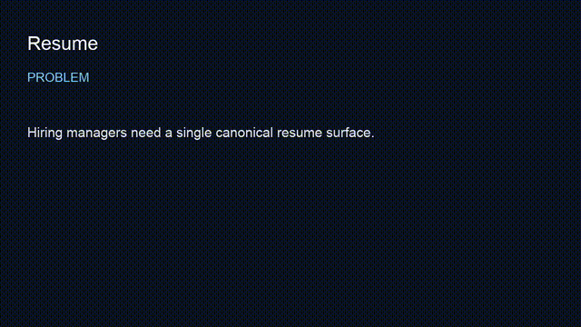

# Resume — Mike Rodgers

**Forward Deployed Engineer**
**Outcome:** Smoke enforces that RESUME.md and the PDF are present (2 of 3 resume formats verified) in a 60-second engineering proof.


This repository is the public, versioned resume for hiring managers and technical leaders.

| File | Use |
| --- | --- |
| [`RESUME.md`](RESUME.md) | Canonical markdown (read on GitHub) |
| [`Mike-Rodgers-Forward-Deployed-Engineer.pdf`](Mike-Rodgers-Forward-Deployed-Engineer.pdf) | Print / ATS-friendly PDF |
| [`Mike-Rodgers-Forward-Deployed-Engineer.docx`](Mike-Rodgers-Forward-Deployed-Engineer.docx) | Original Word source |

## 60-second engineering proof

```bash
git clone https://github.com/mrodgersjs-web/proof-studio.git
cd proof-studio/packages/rigforge && pip install -e . && rigforge demo
```

## Profile & studios

- Profile: https://github.com/mrodgersjs-web  
- Portfolio hub: https://github.com/mrodgersjs-web/fde-portfolio  

## Contact

- Email: mrodgersjs@gmail.com  
- Phone: 262.343.5680  
- LinkedIn: [https://www.linkedin.com/in/mikerodgers/](https://www.linkedin.com/in/mikerodgers/)
- LinkedIn: https://www.linkedin.com/in/mikerodgers/
- Site: https://rodgersintelligence.com/


---

## FDE bar (this studio)

| Practice | Here |
| --- | --- |
| Employer summary | top of README |
| Smoke proof | `bash scripts/smoke.sh` |
| Public boundary | `docs/public-boundary.md` |
| Claim under test | RESUME.md and PDF present |
| Fleet | [profile](https://github.com/mrodgersjs-web) · [resume](https://github.com/mrodgersjs-web/resume) · [patents](https://github.com/mrodgersjs-web/patents) |

If `scripts/smoke.sh` fails, treat README claims as false until fixed.

## Video walkthrough

- [`assets/demo.mp4`](assets/demo.mp4)
- 

